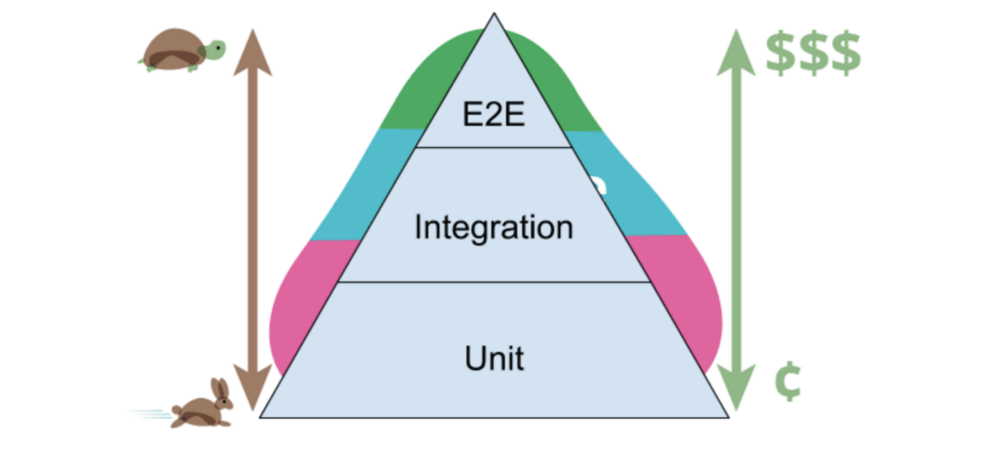
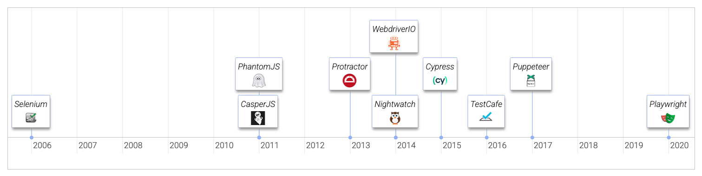

# Kiểm thử End-to-End với Playwright

## E2E Testing là gì?

Kiểm thử End-to-End (E2E) là một phương pháp kiểm thử phần mềm mà:
- Mô phỏng hành vi thực tế của người dùng
- Đảm bảo tất cả các thành phần của ứng dụng hoạt động cùng nhau như mong đợi (frontend → backend → database)

| Ưu điểm | Nhược điểm |
|---------|------------|
| Kiểm thử được toàn bộ hệ thống (backend, frontend, database, network, ...) | Thiết lập môi trường phức tạp (database, server, network, ...) |
| Đảm bảo tính nhất quán trên các thiết bị và trình duyệt khác nhau | Tính không ổn định của kiểm thử (flakey tests) do độ trễ mạng và thời gian phản hồi của server |
| Phát hiện lỗi sớm trong quy trình phát triển | Thời gian thực thi lâu (từ vài phút đến vài giờ) |

## Các loại kiểm thử: Unit, Integration và E2E



| Tiêu chí | Unit Test | Integration Test | E2E Test |
|----------|-----------|------------------|----------|
| Góc nhìn | Engineering (từng thành phần riêng lẻ) | Engineering/Developer Team (tương tác giữa các thành phần) | End User (trải nghiệm toàn bộ hệ thống) |
| Mục tiêu | Đảm bảo các hàm riêng lẻ hoạt động đúng | Kiểm tra tích hợp giữa các thành phần | Xác thực chức năng toàn bộ hệ thống theo hành vi người dùng |
| Phạm vi | Một hàm hoặc phương thức đơn lẻ | Nhiều component/module trong một ứng dụng | Toàn bộ hệ thống bao gồm backend, frontend, database, v.v. |
| Chi phí | Rất thấp (dễ viết, cần ít thiết lập môi trường) | Thấp (ít tài nguyên hơn E2E, nhưng cần thiết lập kết nối) | Cao (mô phỏng môi trường thực, yêu cầu nhiều tài nguyên) |
| Thời gian thực thi | Rất nhanh (vài giây đến vài phút) | Nhanh hơn E2E (< 1 giờ cho 200 test) | Chậm (4-8 giờ hoặc hơn tùy số lượng và độ phức tạp của test) |

### Các framework kiểm thử E2E phổ biến

[](https://shaneofalltrades.com/2024/11/21/top-5-web-testing-frameworks-2024/)

## Giới thiệu về [Playwright](https://playwright.dev/)

Playwright là một framework kiểm thử web hiện đại cho phép kiểm thử E2E đáng tin cậy. Các tính năng chính bao gồm:

- **Hỗ trợ đa trình duyệt**: Tự động hóa kiểm thử trên Chromium, Firefox và WebKit với một API duy nhất
- **Hỗ trợ đa ngôn ngữ**: JavaScript, Python, Java, C#, Go
- **Hỗ trợ đa nền tảng**: Windows, Linux, macOS
- **Kiểm thử web di động**: Mô phỏng trình duyệt di động (Chrome cho Android, Safari cho iOS)
- **Công cụ mạnh mẽ**: Codegen, Trace Viewer, Inspector
- **Auto-waiting**: Playwright thực hiện một loạt các kiểm tra về khả năng tương tác của phần tử trước khi thực hiện hành động để đảm bảo rằng các hành động đó hoạt động như mong đợi.

### Các API cơ bản của Playwright

- [Playwright Test API](https://playwright.dev/docs/api/class-test)
- [Page API](https://playwright.dev/docs/api/class-page)
- [Locators API](https://playwright.dev/docs/api/class-locator) 
- [LocatorAssertions API](https://playwright.dev/docs/api/class-locatorassertions) or [Assertions](https://playwright.dev/docs/test-assertions)

## Cài đặt, viết và chạy tests

```bash
pnpm create playwright
```

- Viết tests: https://playwright.dev/docs/writing-tests
- Chạy tests: https://playwright.dev/docs/running-tests


## Kiểm thử E2E cho trang danh sách tasks

Các test case cần triển khai:
1. Hiển thị trang tasks với các phần tử đúng
2. Lọc tasks theo tên
3. Lọc tasks theo ngày bắt đầu
4. Lọc tasks theo ngày kết thúc
5. Lọc tasks theo khoảng thời gian
6. Lọc tasks theo nhiều tiêu chí
7. Hiển thị nội dung tìm kiếm khi truy cập trang với search params
8. Xóa tất cả bộ lọc và hiển thị tất cả tasks
9. Điều hướng qua phân trang
10. Điều hướng đến trang tạo task mới
11. Xử lý kết quả tìm kiếm trống

## Kiểm thử E2E cho trang tạo task mới

Các test case cần triển khai:
1. Hiển thị trang tạo task mới với các phần tử đúng
2. Kiểm tra tính hợp lệ của trường tên
2. Kiểm tra tính hợp lệ của trường độ ưu tiên
3. Kiểm tra tính hợp lệ của khoảng thời gian
4. Đặt lại các trường form khi nhấn nút Reset
5. Điều hướng trở lại trang tasks
6. Tạo task mới thành công
7. Xử lý đúng giao diện mobile

## Best practices

1. Kiểm thử hành vi người dùng nhìn thấy (Test user-visible behavior)
2. Các test case càng cô lập càng tốt
3. Tránh kiểm thử các phụ thuộc bên thứ ba (Avoid testing third-party dependencies)
4. Kiểm soát dữ liệu kiểm thử (Control test data)

## Tìm hiểu về [Fixtures](https://playwright.dev/docs/test-fixtures)

Fixtures có nhiều ưu điểm hơn so với before/after hooks:

1. **Đóng gói**: Kết hợp setup và teardown trong một nơi
2. **Tái sử dụng**: Định nghĩa một lần, sử dụng trong nhiều file test
3. **Theo yêu cầu**: Chỉ thiết lập các fixtures cần thiết
4. **Kết hợp**: Fixtures có thể phụ thuộc lẫn nhau
5. **Linh hoạt**: Tests có thể sử dụng bất kỳ tổ hợp fixtures nào
6. **Nhóm đơn giản**: Không cần wrap tests trong các describe block để thiết lập môi trường

## Sử dụng VSCode để ghi lại test

- Cài extension: [Playwright Test for VSCode](https://marketplace.visualstudio.com/items?itemName=ms-playwright.playwright)
- Tìm hiểu cách ghi lại tests bằng VSCode: [Tài liệu Codegen](https://playwright.dev/docs/codegen-intro)
